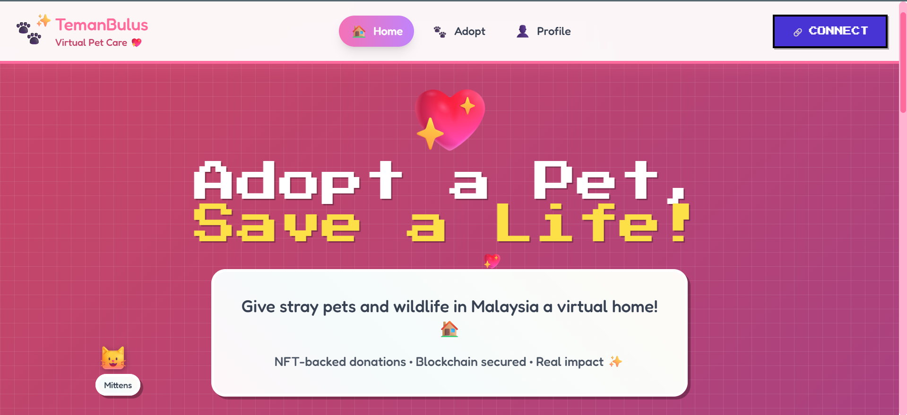

# 🐾 Teman Bulus: Making Every Pawprint Count
## DevMatch Hackathon 2025 Top 5 Finalist (ChatAndBuild Track)

**Teman Bulus** is a blockchain-powered virtual adoption platform designed to bridge the gap between animal lovers and rescue shelters. We transform the way people support animal welfare by ensuring every donation is transparent, every shelter is verified, and every donor feels a real connection to the lives they save.


---

## 🚩 The Problem
Traditional animal welfare and donation systems often suffer from:
* **Transparency Gaps:** Donors rarely know exactly how their money is being utilized.
* **Emotional Disconnect:** A lack of updates makes donors feel like they are just sending money into a void.
* **Physical Barriers:** Many people want to help but lack the time, space, or lifestyle flexibility to adopt a pet physically.

## 🐾 Our Solution
**Teman Bulus** leverages the power of the Ethereum blockchain to create a secure, meaningful, and accessible sponsorship ecosystem.

### Key Features
* **Virtual Adoption:** Sponsor a specific animal’s food, medical, and shelter needs from anywhere in the world.
* **Non-Fungible Authentication (NFA):** A proprietary system that uses blockchain to verify shelter credentials, ensuring your support only goes to legitimate, vetted caretakers.
* **Real-Time Life Logs:** Stay connected with your sponsored animal through photo/video updates and caretaker logs.
* **On-Chain Transparency:** Every contribution is recorded on the Ethereum blockchain, providing an immutable audit trail of your impact.
* **Low-Barrier Support:** Designed for busy individuals who want to make a difference without the demands of physical caregiving.

---

## 🛠 Tech Stack
* **Blockchain:** Ethereum (Smart Contracts)
* **Indexing:** The Graph (Subgraphs for efficient data querying)
* **Frontend:** React / Next.js
* **Authentication:** NFA (Non-Fungible Authentication)
* **Deployment:** ChatandBuild / Vercel

---

## 🧠 Challenges We Conquered
Integrating Ethereum into a seamless user experience was our biggest hurdle. We navigated:
* **The "Connection" Web:** Establishing stable communication between the Ethereum network, backend logic, and **The Graph** subgraphs.
* **Async Management:** Handling the asynchronous nature of blockchain transactions and ensuring UI consistency while waiting for block confirmations.
* **Infrastructure Depth:** Balancing gas fee management with a smooth user flow required us to dive deeper into blockchain infrastructure than we initially anticipated.

---

## 🔗 Project Links
* **Live Demo:** [Teman Bulus App](https://final-teman-bulus-1754747907873.chatand.build/)
* **Video Demo:** [Watch on YouTube](https://www.youtube.com/watch?v=P1H0NfxeouE&feature=youtu.be)
* **Devfolio Project:** [View on Devfolio](https://devfolio.co/projects/teman-bulus-0a09)
* **Presentation:** [Canva Slides](https://www.canva.com/design/DAGvlpj_yY0/vmzNxZq9AQ5q1eBKBrocGw/edit?utm_content=DAGvlpj_yY0&utm_campaign=designshare&utm_medium=link2&utm_source=sharebutton)

---

## 🏗 Installation & Setup (Local)

1.  **Clone the repository:**
    ```bash
    git clone [https://github.com/your-repo/teman-bulus.git](https://github.com/your-repo/teman-bulus.git)
    ```
2.  **Install dependencies:**
    ```bash
    npm install
    ```
3.  **Configure Environment Variables:**
    Create a `.env` file and add your Ethereum Provider URL and Smart Contract addresses.
4.  **Run the application:**
    ```bash
    npm run dev
    ```

---

> **Mission:** To build trust and improve animal welfare worldwide through secure, transparent, and meaningful digital connections. 🐾
